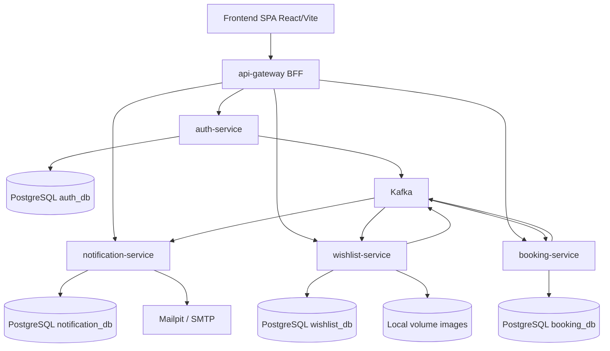

# Architecture — Wishly

**СУБД:** PostgreSQL 15+ (отдельная база на каждый доменный сервис)  
**Соглашения:** `snake_case`, UUID PK, `created_at` / `updated_at`  
**События:** Apache Kafka  
**Деплой MVP:** local Docker Compose, domain `localhost`, CI GitHub Actions  
**Хранилище изображений:** локальный Docker volume (не S3)

Источник требований: `docs/requirements.md`, `docs/pages-spec.md`, `docs/tech-stack.md`, `prototype/`

---

## Принципы декомпозиции (DDD)

| Принцип | Реализация |
|---------|------------|
| Bounded Context | Один микросервис = один контекст; границы по языку домена и транзакционной согласованности |
| Database per Service | Отдельная PostgreSQL-база на сервис; **кросс-сервисные FK запрещены** |
| Aggregate | Транзакционная граница внутри сервиса (один aggregate root на write-операцию) |
| Domain Events | Асинхронная синхронизация и side-effects через Kafka (уведомления, денормализованные статусы) |
| Logical references | Межсервисные связи — UUID без FK; при необходимости — денормализованные snapshot-поля |
| API Gateway / BFF | Единая точка входа SPA; маршрутизация, JWT-проверка на периметре, агрегация read-моделей где нужно |

---

## Карта микросервисов

---

## Сводная таблица сервисов

| Сервис | Bounded Context | База данных | Агрегаты | Страницы frontend |
|--------|-----------------|-------------|----------|-------------------|
| `auth-service` | Identity & Access | `wishly_auth` | `User` | `/login`, `/register`, `/logout`; роль Admin на `/admin` (seed) |
| `wishlist-service` | Wishlist Catalog | `wishly_wishlist` | `Wishlist`, `Category`, `Gift`, `ShareLink`, `Comment` | `/`, `/wishlists`, `/wishlists/new`, `/wishlists/:id`, `/wishlists/:id/edit`, `/wishlists/:id/gifts/new`, `/wishlists/:id/gifts/:giftId/edit`, `/wishlists/:id/trash`, `/w/:token` (каталог + share); soft-delete/restore на `/admin` |
| `booking-service` | Booking | `wishly_booking` | `Booking` | `/my-bookings`; бронирование на `/w/:token`; статусы/имена booker на `/wishlists/:id` и `/admin` |
| `notification-service` | Notifications | `wishly_notification` | `Notification` | `/notifications`; бейдж непрочитанных на `/` / меню |
| `api-gateway` | Edge / BFF | — (без своей БД) | — | Все маршруты SPA через `/api/*`; JWT; прокси upload/static изображений |

Страница `*` / `/404` — только SPA, без доменного сервиса.

**Итого доменных сервисов для реализации backend:** 4 (`auth`, `wishlist`, `booking`, `notification`) + deployable `api-gateway`.

---

## Межсервисные связи (логические UUID, без FK)

| Источник | Поле | Цель (логический ref) | Snapshot / примечание |
|----------|------|------------------------|------------------------|
| `wishlist-service` | `wishlists.owner_id` | `auth-service.users.id` | При отдаче списков — `owner_display_name` из JWT/кэша или запроса к auth через gateway |
| `wishlist-service` | `comments.author_id` | `auth-service.users.id` | Snapshot `author_display_name` при создании комментария |
| `wishlist-service` | `gifts.image_storage_key` | файл в volume | Публичный URL через gateway `/api/media/...` |
| `booking-service` | `bookings.gift_id` | `wishlist-service.gifts.id` | Snapshot: `gift_title`, `wishlist_id`, `wishlist_owner_id`, `booking_deadline` |
| `booking-service` | `bookings.booker_id` | `auth-service.users.id` | Snapshot: `booker_display_name`, `booker_email` (для owner/admin; не в публичном share DTO) |
| `booking-service` | `bookings.cancelled_by_id` | `auth-service.users.id` | Опционально |
| `notification-service` | `notifications.recipient_id` | `auth-service.users.id` | Snapshot email получателя в payload события |
| `notification-service` | `payload.wishlist_id` / `gift_id` / `booker_id` | UUID без FK | Для deep-link в UI |

**Правила:**

1. Запрещены JOIN и FK между базами сервисов.
2. Публичный share (`/w/:token`) отдаёт статусы брони **без** имени booker; имя — только owner/admin через booking-service + проверка прав.
3. При soft-delete gift/wishlist wishlist-service публикует событие; booking-service обновляет read/availability, не ссылаясь FK на wishlist_db.
4. Дедлайн бронирования валидируется в booking-service по snapshot `booking_deadline` (и при необходимости свежим запросом к wishlist через gateway/internal API).

---

## Доменные события (Kafka)

Именование топиков: `wishly.<bounded-context>.events` (compact или JSON; ключ — aggregate id).

| Событие | Топик (пример) | Издатель | Подписчики | Назначение |
|---------|----------------|----------|------------|------------|
| `UserRegistered` | `wishly.auth.events` | auth-service | notification-service (опц. welcome); wishlist-service (кэш профиля при необходимости) | Новый пользователь после регистрации |
| `BookingCreated` | `wishly.booking.events` | booking-service | notification-service; wishlist-service (денорм. флаг «занято» для share/list) | Успешная активная бронь |
| `BookingCancelled` | `wishly.booking.events` | booking-service | notification-service; wishlist-service (освобождение статуса) | Отмена Admin / Owner / booker |
| `GiftSoftDeleted` | `wishly.wishlist.events` | wishlist-service | booking-service (скрыть/отменить активную бронь по политике); notification-service (если нужно уведомить booker) | Soft-delete подарка |
| `WishlistSoftDeleted` | `wishly.wishlist.events` | wishlist-service | booking-service; notification-service | Soft-delete вишлиста |
| `WishlistShared` | `wishly.wishlist.events` | wishlist-service | notification-service (аудит/опц.); analytics later | Выпущен / активирован ShareLink |
| `ShareLinkRevoked` | `wishly.wishlist.events` | wishlist-service | — (MVP: локальная проверка токена в wishlist-service достаточно; событие для аудита/кэшей) | Отзыв публичной ссылки |
| `NotificationRequested` | `wishly.notification.commands` | booking-service (или любой publisher side-effect) | notification-service | Явный запрос in-app + email (канал, recipient, type, payload) |

**Минимальный обязательный набор для MVP-синхронизации:**  
`UserRegistered`, `BookingCreated`, `BookingCancelled`, `GiftSoftDeleted`, `WishlistShared`, `ShareLinkRevoked`, `NotificationRequested`.

Паттерн уведомлений: booking-service после commit публикует `BookingCreated` / `BookingCancelled` **и/или** `NotificationRequested` с полным payload (recipient email, type, ids). notification-service пишет in-app запись и best-effort SMTP (Mailpit в dev).

---

## Роль API Gateway / BFF

| Функция | Описание |
|---------|----------|
| Единая точка | SPA ходит только на `http://localhost:<port>/api/*` |
| Маршрутизация | `/api/auth/*` → auth; `/api/wishlists/*`, `/api/share/*`, `/api/media/*` → wishlist; `/api/bookings/*` → booking; `/api/notifications/*` → notification |
| JWT | Проверка access-токена на защищённых маршрутах; проброс `X-User-Id`, `X-User-Role` во внутренние сервисы (или исходный Bearer) |
| BFF-агрегация | Составные экраны: детали вишлиста + статусы броней; `/admin` — список броней + soft-delete wishlist/gift; публичный share — каталог + occupancy без имён |
| Upload | multipart изображений → wishlist-service; раздача static с volume |
| CORS / ошибки | Единый формат ошибок для SPA |

Gateway **не** владеет доменной БД и **не** публикует доменные события сам (кроме технических access-логов вне MVP).

---

## Заметки по инфраструктуре MVP

### Admin seed

- Учётка администратора создаётся при старте **auth-service** из env: например `ADMIN_EMAIL`, `ADMIN_PASSWORD`, `ADMIN_DISPLAY_NAME`.
- Роль `admin` только через seed (регистрация всегда `role=user`).

### Изображения

- Docker volume, смонтированный в **wishlist-service** (и при необходимости read-only в gateway).
- Лимит 5 МБ; jpeg/png/webp; поле `image_url` (внешний) и/или `image_storage_key` (локальный файл).
- Миграция на S3-compatible — за интерфейсом storage позже; в MVP object storage выключен (`deploy.json`: `objectStorage: false`).

### Kafka

- Брокер в Docker Compose (переопределение batch approvals поверх рекомендации «без брокера» в tech-stack).
- Топики: `wishly.auth.events`, `wishly.wishlist.events`, `wishly.booking.events`, `wishly.notification.commands`.
- Consumer groups: `wishlist-service`, `booking-service`, `notification-service`.

### Email

- notification-service → SMTP (Nodemailer); в Compose — **Mailpit** для просмотра писем на localhost.

### Соглашения БД (все сервисы)

- PostgreSQL 15+
- UUID primary keys
- `snake_case` для таблиц и колонок
- `created_at`, `updated_at` на таблицах сущностей
- Soft delete: `deleted_at` где применимо (wishlist, gift, comment; user — опционально)

---

## Соответствие страницам (DoD mapping)

| Route | Сервисы (≥1) |
|-------|----------------|
| `/login` | auth-service |
| `/register` | auth-service |
| `/logout` | auth-service (+ клиент JWT) |
| `/` | wishlist-service, notification-service (бейдж) |
| `/wishlists` | wishlist-service |
| `/wishlists/new` | wishlist-service |
| `/wishlists/:id` | wishlist-service, booking-service |
| `/wishlists/:id/edit` | wishlist-service |
| `/wishlists/:id/gifts/new` | wishlist-service |
| `/wishlists/:id/gifts/:giftId/edit` | wishlist-service |
| `/wishlists/:id/trash` | wishlist-service |
| `/notifications` | notification-service |
| `/my-bookings` | booking-service |
| `/w/:token` | wishlist-service, booking-service, auth-service (для book flow) |
| `/admin` | auth-service, booking-service, wishlist-service |
| `*` / `/404` | — (SPA) |

---

## Обоснование границ (кратко)

- **auth** отдельно — единый источник пользователей/JWT/admin seed.
- **wishlist** держит каталог, share, комментарии и изображения — одна транзакционная модель владельца.
- **booking** отдельно — жёсткие инварианты «одна активная бронь на gift», отмены, admin-модерация броней; не смешивать с CRUD каталога.
- **notification** отдельный consumer — email + in-app без блокировки write-path брони дольше необходимого; Kafka даёт retries/best-effort.
- Без лишних сервисов (нет отдельного media/comment/share-service) — реализуемо backend-инженерами в MVP.
